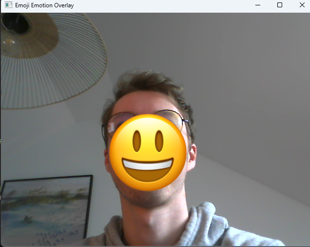

# Emoji Face Detection and Sentiment Analysis


An interactive system that **detects facial expressions in real-time**, overlays dynamic emojis based on your emotions (e.g., smiling, laughing), and analyzes sentiment in static images. Built with OpenCV, MediaPipe, and Keras/TensorFlow.

## 🎯 Project Objective

**Primary Goal**:  
Detect users' facial expressions in real-time using a webcam and **dynamically overlay emotion-specific emojis** (🎭) onto detected faces. This turns your physical expressions into playful digital feedback!  

**Examples**:
- 😊 **Smile** → Displays a smiling emoji.
- 😭 **Sad** → Displays a crying emoji.
- 😐 **Neutral** → Default neutral face.


## 📸 Demonstration: 

### Before vs. After

<div style="display: flex; flex-wrap: wrap; gap: 20px; justify-content: center; align-items: center; margin: 2rem 0">
    <div style="position: relative;">
        <h3>In</h3>
        
    </div>
    <svg height="40" width="60" style="margin: 0 20px">
      <path d="M10 20 L40 20 L30 10 M40 20 L30 30" stroke="#f8f9fa" stroke-width="2" fill="none"/>
      </svg>
    <div style="position: relative;">
        <h3>Out</h3>
        
    </div>
</div>

*Processing example: Facial detection with emoji overlay* 🎭

### With webcam and sentiment analysis

<div style="display: flex; flex-wrap: wrap; gap: 20px; justify-content: center; align-items: center; margin: 2rem 0">
    <div style="position: relative;">
        <h3>Out</h3>
        
    </div>
</div>

*Processing example: Facial detection with emoji overlay* 🎭


**Key Objectives**:
1. **Real-Time Expression Detection**: Classify facial expressions (smile, laugh, neutral) using machine learning.
2. **Dynamic Emoji Switching**: Instantly update emojis based on detected emotions.
3. **Edge-Case Handling**: Smooth emoji placement even near screen borders.
4. **Sentiment Analysis**: Predict emotions from static images as an auxiliary feature.

## Installation

### Prerequisites
- Python 3.9+
- Webcam (for real-time detection)

1. **Clone the Repository**:
   ```bash
   git clone https://github.com/germain-d/Emoji-Face-Detection.git
   cd Emoji-Face-Detection
   ```

2. **Set Up a Virtual Environment**:
   ```bash
   python -m venv .venv
   source .venv/bin/activate  # Linux/Mac
   .venv\Scripts\activate     # Windows
   ```

3. **Install Dependencies**:
   ```bash
   pip install -r requirements.txt
   ```

## Usage

### Real-Time Face Detection with Emoji Overlay
Run the script and specify an emoji image (PNG with transparency):
```bash
python main.py
```
- Press `q` to quit the live feed.
- Adjust emoji size dynamically based on face detection bounding boxes.


## Troubleshooting
- **Shape Mismatch Errors**: Ensure the input image dimensions match `model.input_shape` (check with `print(model.input_shape)`).
- **Webcam Not Detected**: Verify camera permissions or use a static image for testing.
- **Dependency Conflicts**: Use the exact versions in `requirements.txt`.

## Contributing
Pull requests are welcome! For major changes, open an issue first to discuss your ideas.

## License
[MIT](LICENSE)

---

**References**:
- [MediaPipe Face Detection](https://google.github.io/mediapipe/solutions/face_detection)
- [OpenCV Documentation](https://docs.opencv.org/4.x/)
- [Keras Model Saving Guide](https://keras.io/guides/saving_model/)
- [FER-2013 Dataset](https://www.kaggle.com/datasets/msambare/fer2013)
- [Sentiment Analysis Notebook](https://www.kaggle.com/code/veronicacarvalho/sentiment-analysis)
- [Emojis](https://emoji.aranja.com/)
